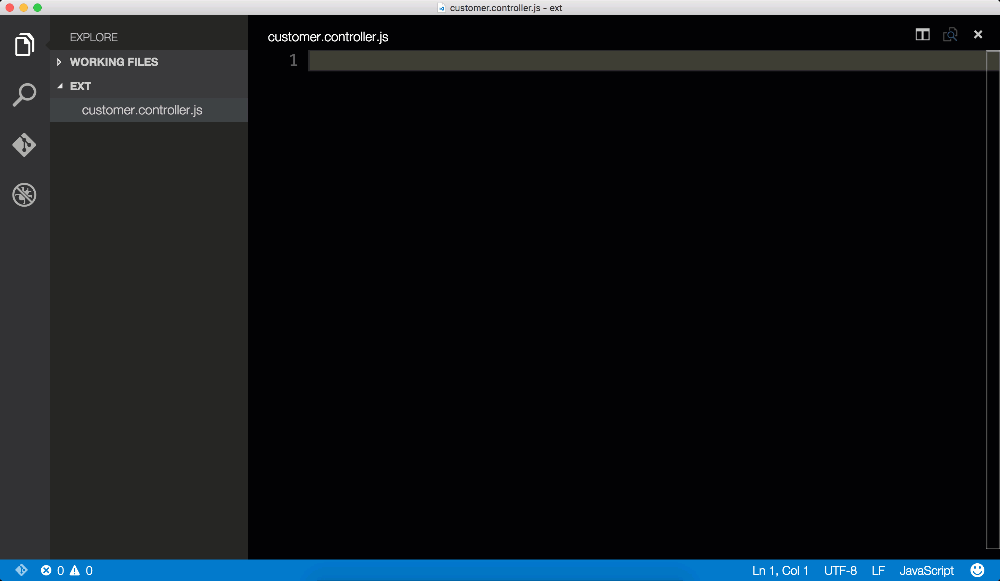
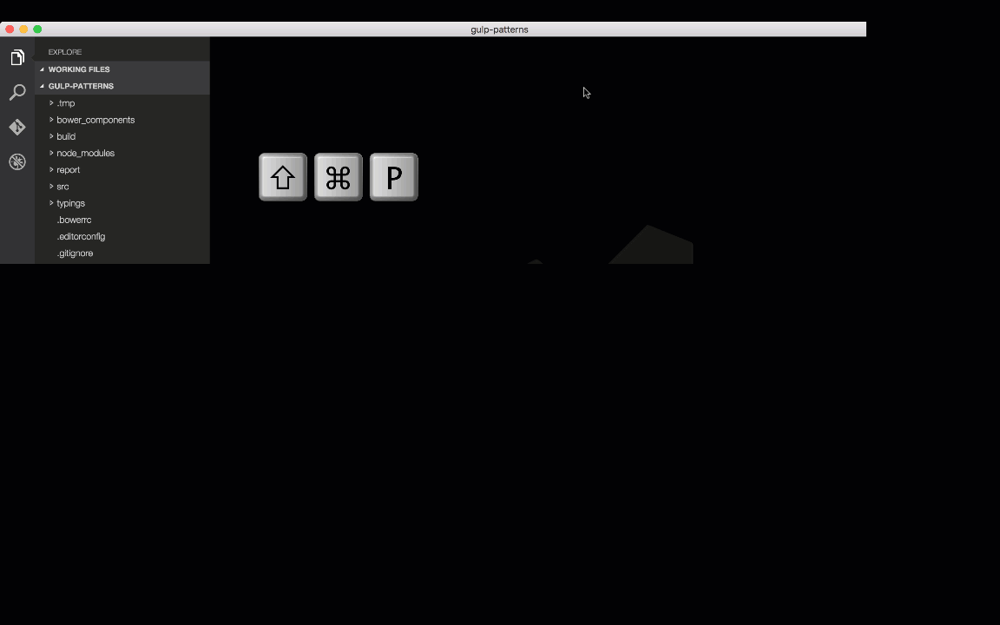

# Angular 1 JavaScript and TypeScript Snippets for VS Code

This extension for Visual Studio Code adds snippets for Angular 1 for JavaScript and TypeScript.



## Usage
Type part of a snippet, press `enter`, and the snippet unfolds.

```javascript
ng1component  // creates an Angular component
ng1controller // creates an Angular controller
ng1directive  // creates an Angular directive
ng1factory    // creates an Angular factory
ng1module     // creates an Angular module
ng1service    // creates an Angular service
ng1filter     // creates an Angular filter
```

Alternatively, press `Ctrl`+`Space` (Windows, Linux) or `Cmd`+`Space` (OSX) to activate snippets from within the editor.

## Installation

1. Install Visual Studio Code 0.10.1 or higher
2. Launch Code
3. From the command palette `Ctrl`-`Shift`-`P` (Windows, Linux) or `Cmd`-`Shift`-`P` (OSX)
4. Select `Install Extension`
5. Choose the extension
6. Reload Visual Studio Code


